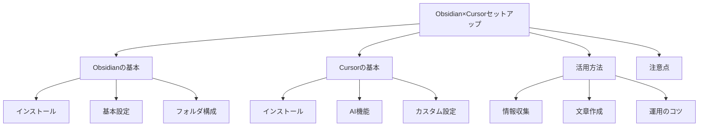

# Obsidian×Cursor セットアップ
### ソース
-  [[メモ管理は Obsidian in  Cursor が最強｜松濤Vimmer]]
- [[「Obsidian」と「Cursor」を使って、noteの記事をどんどこ書く｜akane]]
- [[Obsidianに記事メモをためる Web Clipper（ブラウザのタブを全部閉じたい）]]
- [[Cursorに自分のnoteとObsidianを読み込ませて記事を書いてもらう｜dora_e_m]]

## はじめに

Obsidian と Cursor は、それぞれ単体でも便利なツールですが、組み合わせることでより強力なメモ管理・文章作成環境を構築できます。この記事では、両ツールの基本的な説明から、具体的な活用方法までを紹介します。

### この記事の構成



## Obsidian とは？

Obsidian は、Markdown 形式のドキュメントを管理するためのアプリケーションです。主な特徴は以下の通りです：

| 機能             | 説明                         |
| ---------------- | ---------------------------- |
| ローカル動作     | インターネット接続不要で動作 |
| リンク機能       | ファイル間の相互参照が可能   |
| プラグイン       | 機能を自由に拡張可能         |
| インターフェース | シンプルで使いやすい         |


### 基本的な使い方

1. **インストール**

   - [Obsidian 公式サイト](https://obsidian.md/)からダウンロード
   - インストール後、保存先フォルダを指定

2. **Web Clipper の設定**

   - Chrome 拡張機能「Obsidian Web Clipper」をインストール
   - 設定からテンプレートをカスタマイズ可能

3. **基本的なフォルダ構成例**

```
.
├── capture/          # Web記事の保存先
│   ├── articles/     # 記事
│   └── references/   # 参考文献
├── note/            # アウトプット用
│   ├── 01_idea/     # アイデア
│   ├── 02_doing/    # 執筆中
│   └── 03_published/# 公開済み
└── templates/       # テンプレート
    ├── article.md   # 記事用
    └── note.md      # メモ用
```

### Obsidian の便利な機能

1. **グラフビュー**

   - ノート間の関連性を視覚化
   - 知識の構造を把握しやすい

2. **タグシステム**

   - 複数のタグで分類可能
   - タグによる検索が容易

3. **テンプレート機能**
   - 定型文の自動挿入
   - メタデータの管理

## Cursor とは？

Cursor は、AI 機能を搭載したコードエディタです。主な特徴は：

| 機能            | 説明                   |
| --------------- | ---------------------- |
| AI アシスタント | 文章作成をサポート     |
| ファイル参照    | ローカルファイルの検索 |
| カスタム指示    | 独自のルール設定       |
| 文章作成        | 効率的な執筆環境       |


### 基本的な使い方

1. **インストール**

   - [Cursor 公式サイト](https://www.cursor.com/ja)からダウンロード

2. **カスタム指示の設定**
   - Settings -> Rules -> User Rules で設定
   - 文体や参照ルールなどを定義可能

### Cursor の AI 機能

1. **文章生成**

   - プロンプトに基づく文章作成
   - 文体の統一
   - 引用の自動生成

2. **文章校正**
   - 文法チェック
   - 文体の改善提案
   - 読みやすさの向上

## Obsidian×Cursor の活用方法

### 1. 情報収集から文章作成までの流れ


1. **情報収集（Obsidian）**

   - Web Clipper で気になる記事を保存
   - タグ付けやメタデータの管理
   - 関連記事のリンク作成

2. **文章作成（Cursor）**
   - Obsidian のファイルを参照
   - AI アシスタントと対話しながら文章作成
   - 過去のメモや引用の活用

### 2. 具体的な活用例

#### 記事のまとめ作成

1. Obsidian で関連記事を収集
2. Cursor で記事の内容を分析
3. 構成案の作成
4. 文章の執筆

#### 読書メモの活用

1. Kindle のハイライトを Obsidian に保存
2. Cursor で関連する内容を参照
3. 読書感想や要約の作成

### 3. 効率的な運用のコツ

- **タグの活用**

  - 一貫性のある命名規則
  - 適切な粒度でのタグ付け
  - 定期的なタグの整理

- **テンプレートの活用**

  - 記事の基本構成
  - メタデータの管理
  - 引用の形式

- **AI との対話**
  - 具体的な指示の出し方
  - 文体の統一
  - 参照範囲の指定

## 注意点

1. **データの管理**

   - ローカルでの保存が基本
   - バックアップの重要性
   - セキュリティへの配慮

2. **AI の活用**
   - 生成された内容の確認
   - 適切な指示の出し方
   - 手動での修正の必要性

## まとめ

Obsidian と Cursor の組み合わせは、情報収集から文章作成までを効率的に行うことができます。特に：

- 情報の一元管理
- 効率的な文章作成
- 過去の知識の活用
- 一貫性のある文体の維持

これらのメリットを活かすことで、より質の高いアウトプットが可能になります。

## 参考記事

- [[メモ管理は Obsidian in  Cursor が最強｜松濤Vimmer]]
- [[「Obsidian」と「Cursor」を使って、noteの記事をどんどこ書く｜akane]]
- [[Obsidianに記事メモをためる Web Clipper（ブラウザのタブを全部閉じたい）]]
- [[Cursorに自分のnoteとObsidianを読み込ませて記事を書いてもらう｜dora_e_m]]
